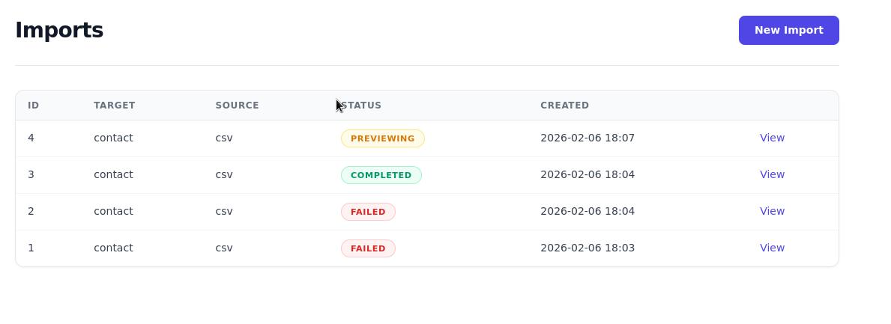
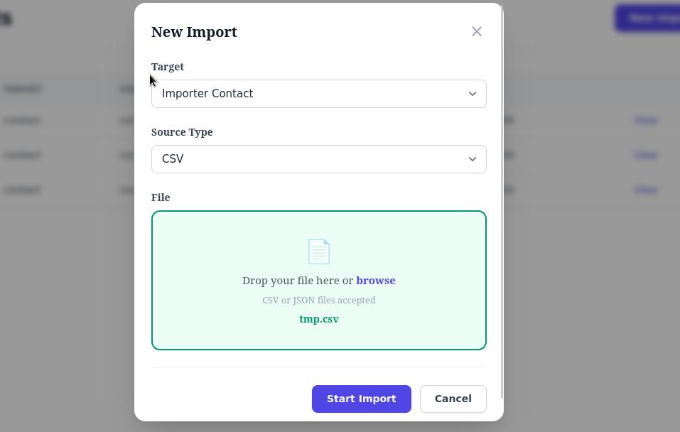
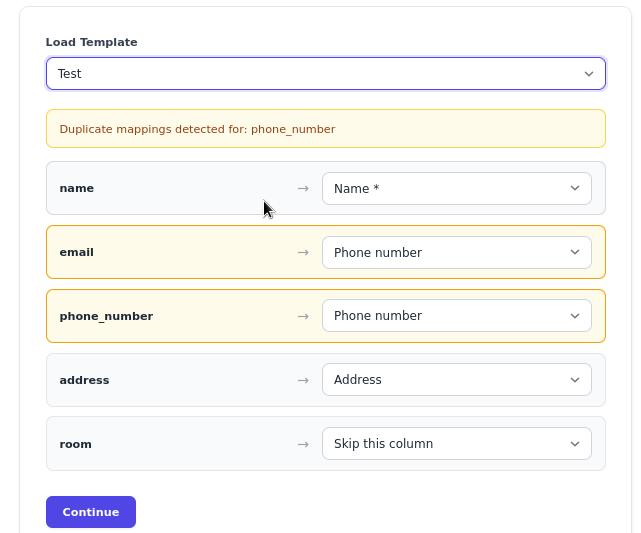
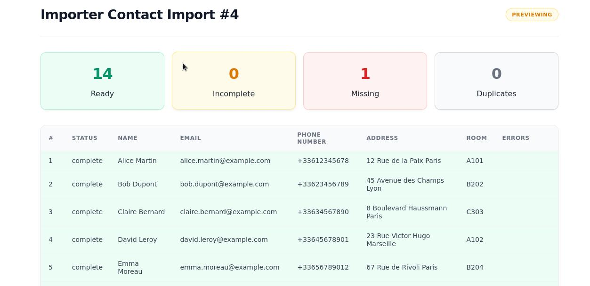

# DataPorter

> [!CAUTION]
> **This gem is under active development and not yet production-ready.**
> APIs and features may change without notice. Use at your own risk.

A mountable Rails engine for data import workflows: **Upload**, **Map**, **Preview**, **Import**.

Supports CSV, JSON, XLSX, and API sources with a declarative DSL for defining import targets. Business-agnostic by design -- all domain logic lives in your host app.

<table>
  <tr>
    <td></td>
    <td></td>
  </tr>
  <tr>
    <td></td>
    <td></td>
  </tr>
</table>

## Features

- **4 source types** -- CSV, XLSX, JSON, and API with a unified parsing pipeline
- **Interactive column mapping** -- Drag-free UI to match file headers to target fields ([docs](docs/MAPPING.md))
- **Mapping templates** -- Save and reuse column mappings across imports ([docs](docs/MAPPING.md#mapping-templates))
- **Real-time progress** -- JSON polling with animated progress bar, no ActionCable required
- **Dry run mode** -- Validate against the database without persisting
- **Standalone UI** -- Self-contained layout with Turbo Drive and Stimulus, no host app dependencies
- **Import params** -- Declare extra form fields (select, text, number, hidden) per target for scoped imports ([docs](docs/TARGETS.md#params--))
- **Per-target source filtering** -- Each target declares its allowed sources, the UI filters accordingly
- **Import deletion & auto-purge** -- Delete imports from the UI, or schedule `rake data_porter:purge` for automatic cleanup
- **Reject rows export** -- Download a CSV of failed/errored records with error messages after import
- **Security validations** -- File size limit, MIME type check, strong parameter whitelisting
- **Safety guards** -- Max records limit (`config.max_records`), configurable transaction mode (`:per_record` or `:all`)
- **Declarative Target DSL** -- One class per import type, zero boilerplate ([docs](docs/TARGETS.md))

## Requirements

- Ruby >= 3.2
- Rails >= 7.0
- ActiveStorage (for file uploads)

## Installation

```bash
bundle add data_porter
bin/rails generate data_porter:install
bin/rails db:migrate
```

The generator creates:
- Migrations for `data_porter_imports` and `data_porter_mapping_templates`
- An initializer at `config/initializers/data_porter.rb`
- The `app/importers/` directory
- Engine mount at `/imports`

## Quick Start

Generate a target:

```bash
bin/rails generate data_porter:target Product name:string:required price:integer sku:string --sources csv xlsx
```

Implement `persist` in `app/importers/product_target.rb`:

```ruby
class ProductTarget < DataPorter::Target
  label "Product"
  model_name "Product"
  icon "fas fa-file-import"
  sources :csv

  columns do
    column :name,  type: :string, required: true
    column :price, type: :integer
    column :sku,   type: :string
  end

  def persist(record, context:)
    Product.create!(record.attributes)
  end
end
```

Visit `/imports` and start importing.

## Import Workflow

```
File-based (CSV/XLSX):
pending -> extracting_headers -> mapping -> parsing -> previewing -> importing -> completed

Non-file (JSON/API):
pending -> parsing -> previewing -> importing -> completed
```

| Status | Description |
|---|---|
| `pending` | Waiting for processing |
| `extracting_headers` | Reading file headers for column mapping |
| `mapping` | Waiting for user to map columns |
| `parsing` | Records being extracted |
| `previewing` | Records ready for review |
| `importing` | Records being persisted |
| `completed` | All records processed |
| `failed` | Fatal error encountered |
| `dry_running` | Dry run validation in progress |

## Documentation

| Topic | Description |
|---|---|
| [Configuration](docs/CONFIGURATION.md) | All options, authentication, context builder, real-time updates |
| [Targets](docs/TARGETS.md) | DSL reference, columns, hooks, generator |
| [Sources](docs/SOURCES.md) | CSV, JSON, XLSX, API setup and examples |
| [Column Mapping](docs/MAPPING.md) | Interactive mapping, templates, priority order |
| [Roadmap](docs/ROADMAP.md) | v1.0 plan and progress |

## Routes

| Method | Path | Action |
|---|---|---|
| GET | `/imports` | List imports |
| POST | `/imports` | Create import |
| GET | `/imports/:id` | Show import |
| DELETE | `/imports/:id` | Delete import |
| GET | `/imports/:id/status` | JSON progress polling |
| PATCH | `/imports/:id/update_mapping` | Save column mapping |
| POST | `/imports/:id/parse` | Parse source |
| POST | `/imports/:id/confirm` | Run import |
| POST | `/imports/:id/cancel` | Cancel import |
| POST | `/imports/:id/dry_run` | Dry run validation |
| GET | `/imports/:id/export_rejects` | Download rejects CSV |
| | `/mapping_templates` | Full CRUD for templates |

## Development

```bash
git clone https://github.com/SerylLns/data_porter.git
cd data_porter
bin/setup
bundle exec rspec     # 391 specs
bundle exec rubocop   # 0 offenses
```

## License

The gem is available as open source under the terms of the [MIT License](https://opensource.org/licenses/MIT).
