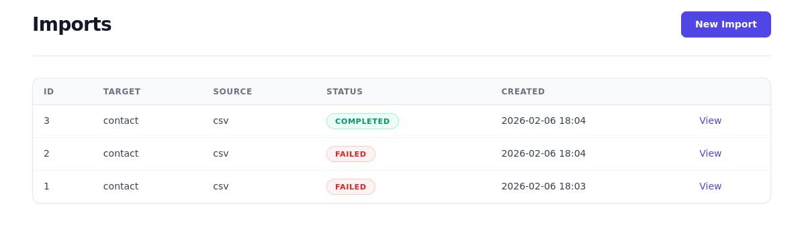

# Getting Started

## Installation

```bash
bundle add data_porter
bin/rails generate data_porter:install
bin/rails db:migrate
```

The generator creates:

- Migrations for `data_porter_imports` and `data_porter_mapping_templates`
- An initializer at `config/initializers/data_porter.rb`
- The `app/importers/` directory
- Engine mount at `/imports`

## Create Your First Target

Generate a target for your model:

```bash
bin/rails generate data_porter:target Product name:string:required price:decimal sku:string --sources csv xlsx
```

This creates `app/importers/product_target.rb`. Implement the `persist` method:

```ruby
class ProductTarget < DataPorter::Target
  label "Products"
  model_name "Product"
  icon "fas fa-box"
  sources :csv, :xlsx

  columns do
    column :name,  type: :string, required: true
    column :price, type: :decimal
    column :sku,   type: :string
  end

  def persist(record, context:)
    Product.create!(record.attributes)
  end
end
```

Visit `/imports` and start importing!

## Import Workflow

DataPorter guides users through a multi-step workflow depending on the source type:

=== "File-based (CSV/XLSX)"

    ```
    pending → extracting_headers → mapping → parsing → previewing → importing → completed
    ```

=== "Structured (JSON/API)"

    ```
    pending → parsing → previewing → importing → completed
    ```

### Status Reference

| Status | Description |
|---|---|
| `pending` | Waiting for processing |
| `extracting_headers` | Reading file headers for column mapping |
| `mapping` | Waiting for user to map columns |
| `parsing` | Records being extracted |
| `previewing` | Records ready for review |
| `importing` | Records being persisted |
| `completed` | All records processed |
| `failed` | Fatal error encountered |
| `dry_running` | Dry run validation in progress |

## Screenshots

### Import List



### New Import Modal


### Column Mapping


### Preview


## Next Steps

- [Configuration](CONFIGURATION.md) — Authentication, scoping, and all options
- [Targets](TARGETS.md) — Full DSL reference with hooks and params
- [Sources](SOURCES.md) — CSV, XLSX, JSON, and API source details
- [Column Mapping](MAPPING.md) — Interactive mapping and templates
- [Views & Theming](VIEWS.md) — View generator, CSS variables, and dark mode
