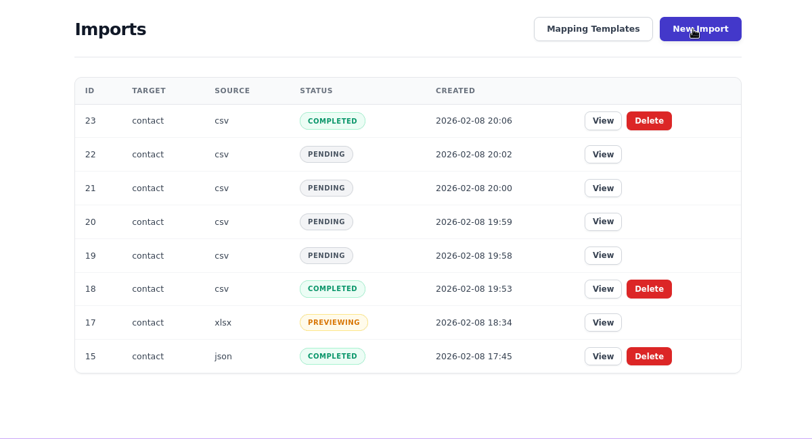

# DataPorter

**A mountable Rails engine for data import workflows.**

Upload, Map, Preview, Import — supports CSV, XLSX, JSON, and API sources with a declarative DSL for defining import targets. Business-agnostic by design: all domain logic lives in your host app.

[](https://badge.fury.io/rb/data_porter)



---

## Features

<div class="grid cards" markdown>

-   :material-file-delimited:{ .lg .middle } **4 Source Types**

    ---

    CSV, XLSX, JSON, and API with a unified parsing pipeline

-   :material-swap-horizontal:{ .lg .middle } **Interactive Column Mapping**

    ---

    Drag-free UI to match file headers to target fields, with saved templates

-   :material-progress-check:{ .lg .middle } **Real-time Progress**

    ---

    JSON polling with animated progress bar, no ActionCable required

-   :material-test-tube:{ .lg .middle } **Dry Run Mode**

    ---

    Validate against the database without persisting a single record

-   :material-form-select:{ .lg .middle } **Import Params**

    ---

    Declare extra form fields (select, text, number, hidden) per target

-   :material-shield-lock:{ .lg .middle } **Security Built-in**

    ---

    File size limit, MIME type check, strong parameters, IDOR protection via scope

-   :material-account-group:{ .lg .middle } **Multi-tenant Isolation**

    ---

    `config.scope` ensures each user only sees their own imports

-   :material-code-braces:{ .lg .middle } **Declarative Target DSL**

    ---

    One class per import type, zero boilerplate

</div>

---

!!! tip "Follow the build series"
    Want to see how DataPorter was built from scratch, step by step?
    **[Building DataPorter on dev.to](https://dev.to/seryllns_/series/35813)** -- a 30-part series covering architecture decisions, TDD workflow, and every feature from first commit to production.

---

## Quick Example

```ruby
class ProductTarget < DataPorter::Target
  label "Products"
  model_name "Product"
  sources :csv, :xlsx

  columns do
    column :name,  type: :string, required: true
    column :price, type: :decimal
    column :sku,   type: :string
  end

  def persist(record, context:)
    Product.create!(record.attributes)
  end
end
```

Visit `/imports` and start importing.

---

## Requirements

| Dependency | Version |
|---|---|
| Ruby | >= 3.2 |
| Rails | >= 7.0 |
| ActiveStorage | Required for file uploads |

---

<div class="grid cards" markdown>

-   :material-rocket-launch:{ .lg .middle } **Getting Started**

    ---

    Install DataPorter and create your first import target in minutes.

    [:octicons-arrow-right-24: Getting Started](getting-started.md)

-   :material-cog:{ .lg .middle } **Configuration**

    ---

    Authentication, scoping, context builder, and all available options.

    [:octicons-arrow-right-24: Configuration](CONFIGURATION.md)

-   :material-bullseye-arrow:{ .lg .middle } **Targets**

    ---

    The complete DSL reference: columns, hooks, params, and examples.

    [:octicons-arrow-right-24: Targets](TARGETS.md)

-   :material-database-import:{ .lg .middle } **Sources**

    ---

    CSV, XLSX, JSON, and API source setup and examples.

    [:octicons-arrow-right-24: Sources](SOURCES.md)

-   :material-book-open-variant:{ .lg .middle } **Full Reference**

    ---

    Mapping, views, routes, advanced features, and more.

    [:octicons-arrow-right-24: Reference](CONFIGURATION.md)

</div>
